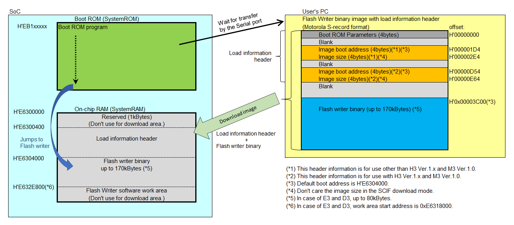

# 1. Overview
-------------
## 1.1. Overview
This document explains about R-Car H3/M3/M3N/E3 Flash writer sample software.<BR>
The Flash writer is downloaded from the Host PC via SCIF or USB by boot ROM.<BR>
And the Flash writer downloads the some of the raw images from Host PC via SCIF or USB, and writes the raw images to the Serial NOR Flash and HyperFlash&trade;(hereafter referred to as &ldquo;Serial Flash&rdquo;), eMMC.<BR>
The Flash wrriter Serial Flash writing support is HyperFlash&trade; in SiP packge, and on-board Serial NOR Flash(i.e. S25FS128S).<BR>
The Flash writer eMMC writing support is High Speed SDR(i.e. 50MHz) and x8 bus width mode.<BR>

[Chapter 2](#2-operating-environment) describes the operating environment.<BR>
[Chapter 3](#3-software) describes the software.<BR>
[Chapter 4](#4-how-to-build-the-flash-writer) explains example of how to build the Flash writer.<BR>
[Chapter 5](#5-how-to-run-flash-writer) explains example of how to perform the Flash writer.<BR>
[Chapter 6](#-6-usb-download-api) explains specifications of USB download API.<BR>
[Chapter 7](#7-error-case-to-handle) explains how to handle error case.<BR>

*Note) This sample software does not support the file system. Therefore, can be write the raw image to the Serial NOR Flash and HyperFlash&trade;, eMMC.*

## 1.2. References
The following table shows the document related to this function.

##### Related Document
| Number | Issue   | Title                                                          | Edition      |
|--------|---------|----------------------------------------------------------------|--------------|
| 1      | JEDEC   | Embedded Multi-Media Card (eMMC) Electrical Standard (5.01)    | JESD84-B50.1 |
| 2      | Cypress | S25FS128S, S25FS256S 1.8V, Serial Peripheral Interface with Multi-I/O, MirrorBit&reg; Non-Volatile Flash Datasheet | Rev. *J |
| 3      | Cypress | 512 MBIT, 256 MBIT, 128 MBIT HYPERFLASH FAMILY Datasheet       | Rev. *H      |

## 1.3. Restrictions
There is no restriction in this revision.

# 2. Operating Environment
--------------------------
## 2.1. Hardware Environment
The following table lists the hardware needed to use this function.

##### Hardware environment (R-Car H3/M3/M3N/E3)
| Name                          | Note                                      |
|-------------------------------|-------------------------------------------|
| R-Car H3-SiP System Evaluation Board Salvator-X<BR>R-Car M3-SiP System Evaluation Board Salvator-X<BR>R-Car H3-SiP System Evaluation Board Salvator-XS<BR>R-Car M3-SiP System Evaluation Board Salvator-XS<BR>R-Car M3N-SiP System Evaluation Board Salvator-XS<BR>R-Car E3 System Evaluation Board Ebisu | RTP0RC7795SIPB0010S / RTP0RC7795SIPB0011S<BR>RTP0RC7796SIPB0010S / RTP0RC7796SIPB0011S<BR>RTP0RC7795SIPB0012S<BR>RTP0RC7796SIPB0012S<BR>RTP0RC77965SIPB012S<BR>RTP0RC77990SEB0010S |
| Host PC                       | Ubuntu Desktop 14.04(64bit) or later          |
| USB cable (type A to micro B) | Connect to CN25 when using UART connection. (SCIF2)<BR>Connect to CN9 when using USB connection. (HS-USB) |

*Note) RTP0RC7795SIPB0010S needs to update to the latest PMIC-EEPROM settings.*<BR>
*Note) After starting the Flash writer, CN9 and CN25 can not be used in parallel. Please use only either one.*

The following table shows Serial Flash and eMMC support for each SoC.

##### Serial Flash / eMMC support status of each SoC
| SoC                                   | Read/Write the Serial Flash | Boot from the Serial Flash | Read/Write the eMMC | Boot from the eMMC | MMC interface |
|---------------------------------------|-----------------------------|----------------------------|---------------------|--------------------|---------------|
| R-Car E3 Ver.1.0                      | Support                     | Support                    | Support             | Support            | MMC1          |
| R-Car M3N Ver.1.1 / R-Car M3N Ver.1.0 | Support                     | Support                    | Support             | Support            | MMC0          |
| R-Car M3 Ver.1.1  / R-Car M3 Ver.1.0  | Support                     | Support                    | Support             | Support            | MMC0          |
| R-Car H3 Ver.2.0                      | Support                     | Support                    | Support             | Support            | MMC0          |
| R-Car H3 Ver.1.1  / R-Car H3 Ver.1.0  | Support                     | Support                    | Support             | Not support        | MMC0          |

The following table shows USB support for each SoC.

##### USB download support status of each SoC
| SoC                                   | Image download by USB | Boot from the USB download mode |
|---------------------------------------|-----------------------|---------------------------------|
| R-Car E3 Ver.1.0                      | Support               | Support                         |
| R-Car M3N Ver.1.1 / R-Car M3N Ver.1.0 | Support               | Support                         |
| R-Car M3 Ver.1.1  / R-Car M3 Ver.1.0  | Support               | Not Support                     |
| R-Car H3 Ver.2.0                      | Support               | Support                         |
| R-Car H3 Ver.1.1  / R-Car H3 Ver.1.0  | Support               | Not support                     |

USB 2.0 High-speed is supported. USB device class is CDC ACM compliant.<BR>
Host PC's USB driver uses OS standard in-box driver.<BR>

The following table shows USB Vendor ID and Product ID.

##### List of USB Vendor ID and Product ID
| SoC       | Vendor ID (Renesas) | Product ID |
|-----------|---------------------|------------|
| R-Car E3  | 0x045B              | 0x024D     |
| R-Car M3N | 0x045B              | 0x0248     |
| R-Car M3  | 0x045B              | 0x023D     |
| R-Car H3  | 0x045B              | 0x023C     |

#### Recommended Environment


# 2.2. Software Environment
The following table lists the software needed to use this function.

##### Software environment
| Name             | Note                                                                      |
|------------------|---------------------------------------------------------------------------|
| Linaro Toolchain | Linaro Stable Binary Toolchain Release GCC 5.2-2015.11-2 for aarch64-elf. |
|                  | Linaro Stable Binary Toolchain Release GCC 5.2-2015.11-2 for arm-eabi.    |


# 3. Software
-------------
## 3.1. Function
This package has the following functions.
- Write to the images to the Serial Flash.
- Erase the Serial Flash.
- Display the CID/CSD/EXT_CSD registers of eMMC.
- Modify the EXT_CSD registers of eMMC.
- Write to the images to the boot partition of eMMC.
- Write to the images to the user data area of eMMC.
- Erase the boot partition of eMMC.
- Erase the user data area of eMMC.
- Change to the SCIF baud rate setting.
- Display the command help.

## 3.2. Module structure
This module structure is shown below.
#### Module structure
```text
flash_writer                            : root directory of Flash writer
|-- AArch32_boot                        : boot code for AArch32
|-- AArch64_boot                        : boot code for AArch64
|-- AArch32_obj                         : object file output directory for AArch32
|-- AArch64_obj                         : object file output directory for AArch64
|-- AArch32_output                      : output directory for AArch32
|-- AArch64_output                      : output directory for AArch64
|-- AArch32_lib                         : USB library directory for AArch32
|-- AArch64_lib                         : USB library directory for AArch64
|-- ddr                                 : DRAM initialize code directory
|-- include                             : header files directory
|-- b_boarddrv.c                        : identify the board type
|-- boardid.c                           : identify the board type
|-- boot_init_gpio.c                    : GPIO initialize code
|-- boot_init_lbsc.c                    : Local bus state controller initialize code
|-- boot_init_port.c                    : Pin function initialize code
|-- cert_param.c                        : image header for SCIF/USB download image
|-- common.c                            : miscellaneous code
|-- cpudrv.c                            : miscellaneous code
|-- devdrv.c                            : log output code
|-- dg_emmc_access.c                    : eMMC writer code
|-- dg_emmc_config.c                    : eMMC device configuration code
|-- dginit.c                            : initialize code
|-- dgmodul1.c                          : miscellaneous code
|-- dgmodul4.c                          : Serial NOR Flash/HyperFlash writer code
|-- dgtable.c                           : command table
|-- dmaspi.c                            : DMA driver code
|-- emmc_cmd.c                          : eMMC driver code
|-- emmc_erase.c                        : eMMC driver code
|-- emmc_init.c                         : eMMC driver code
|-- emmc_interrupt.c                    : eMMC driver code
|-- emmc_mount.c                        : eMMC driver code
|-- emmc_utility.c                      : eMMC driver code
|-- emmc_write.c                        : eMMC driver code
|-- init_scif.c                         : SCIF initialize code
|-- main.c                              : main program
|-- Message.c                           : Help message
|-- micro_wait.c                        : miscellaneous code
|-- ramckmdl.c                          : memory clear code(i.e. memset)
|-- rpchyperdrv.c                       : HyperFlash driver code
|-- rpcqspidrv.c                        : Serial NOR Flash driver code
|-- scifdrv.c                           : SCIF driver
|-- spiflash0drv.c                      : Serial NOR Flash driver code
|-- spiflash1drv.c                      : Serial NOR Flash driver code
|-- switch.c                            : Dip-switch setting messages
|-- timer_api.c                         : timer API for eMMC driver
|-- memory_area0.def                    : Linker script for Salvator-X/XS board.
|-- memory_writer.def                   : Linker script for Salvator-X/XS board.
|-- memory_writer_small.def             : Linker script for Ebisu board.
|-- memory_writer_small_with_cert.def   : Linker script for Ebisu board.
|-- memory_writer_with_cert.def         : Linker script for Salvator-X/XS board.
`-- makefile                            : makefile
```

## 3.3. Option setting
The Flash writer support the following build options.

### 3.3.1. AArch
Select from the following table according to the target CPU architecture.<BR>
This option must match the using compiler.<BR>

##### Association table for the AArch value and valid CPU architecture

| AArch | CPU architecture setting                                                                                                                      |
|-------|-----------------------------------------------------------------------------------------------------------------------------------------------|
| 32    | Generate binary that works on AArch32.<BR>It works on both the AP-system Core(i.e. Cortex-A57/A53) and the ARM Realtime Core(i.e. Cortex-R7). |
| 64    | Generate binary that works on AArch64.<BR>It works on only the AP-System Core(i.e. Cortex-A57/A53).                                           |

### 3.3.2. BOARD<BR>
Select from the following table according to the board settings.<BR>
If this option is not selected, the default value is SALVATOR.<BR>

| BOARD    | BOARD setting                                                |
|----------|--------------------------------------------------------------|
| SALVATOR | Generate binary that works on Salvator-X/XS board. (default) |
| EBISU    | Generate binary that works on Ebisu board.                   |

### 3.3.3. BOOT<BR>
Select from the following table according to the image header settings.<BR>
If this option is not selected, the default value is WRITER_WITH_CERT.<BR>

##### Association table for the BOOT value and valid image header settings

| BOOT             | Image header setting                                                                                                                                             |
|------------------|------------------------------------------------------------------------------------------------------------------------------------------------------------------|
| WRITER           | Generate binary for download mode without the load information header.                                                                                           |
| WRITER_WITH_CERT |Generate binary for download mode with the load information header. (default)<BR>This image can be used in both the SCIF download mode and the USB download mode. |

Describe the details of the SCIF/USB download image as follows:

##### Detail of binary image


### 3.3.4. SCIF_CLK<BR>
Select from the following table according to the clock to be supplied to SCIF.<BR>
This setting is valid when "SALVATOR" is selected with the BOARD option.<BR>
If this option is not selected, the default value is EXTERNAL.<BR>

##### Association table for the SCIF_CLK value and valid SCIF clock source settings
| SCIF_CLK | SCIF clock source setting                                                                                                                                 |
|----------|-----------------------------------------------------------------------------------------------------------------------------------------------------------|
| INTERNAL | The SCIF clock source is S3D4&phi; (i.e. 66.6666MHz) in the SoC.<BR>H3 Ver.1.0: Maximum baud rate is 115200bps.<BR>Other: Maximum baud rate is 230400bps. |
| EXTERNAL | The SCIF clock source is SCK2 pin. (default)<BR>Maximum baud rate is 921600bps.<BR>Please supply the 14.7456MHz to the SCK2 pin.                          |

*Note) On the Salvator-X/XS board, 14.7456MHz is supplied to the SCK2 pin.*

### 3.3.5. USB
Select from the following table according to the USB download function.<BR>
If this option is not selected, the default value is ENABLE.<BR>

#### Association table for the USB value and valid USB download fucntion settings
| USB     | USB setting                                   |
|---------|-----------------------------------------------|
| ENABLE  | USB download function is available. (default) |
| DISABLE | USB download function is not available.       |

### 3.3.6. SERIAL_FLASH
Select from the following table according to the Serial Flash writing function.<BR>
If this option is not selected, the default value is ENABLE.<BR>

#### Association table for the SERIAL_FLASH value and valid Serial Flash writing function settings
| SERIAL_FLASH | Serial Flash writing setting                          |
|--------------|-------------------------------------------------------|
| ENABLE       | Serial Flash writing function is available. (default) |
| DISABLE      | Serial Flash writing function is not available.       |

## 3.4. Command specification
The following table shows the command list.

##### Command list
| Command  | Description                                                                                        |
|----------|----------------------------------------------------------------------------------------------------|
| XLS2     | Write to the S-record format images to the Serial Flash.                                           |
| XLS3     | Write to the raw binary images to the Serial Flash.                                                |
| XCS      | Erase the Serial Flash.                                                                            |
| EM_DCID  | Display the CID registers of eMMC.                                                                 |
| EM_DCSD  | Display the CSD registers of eMMC.                                                                 |
| EM_DECSD | Display the EXT_CSD registers of eMMC.                                                             |
| EM_SECSD | Modify the EXT_CSD registers of eMMC.                                                              |
| EM_W     | Write to the S-record format images to the user data area of eMMC, and the boot partition of eMMC. |
| EM_WB    | Write to the raw binary images to the user data area of eMMC, and the boot partition of eMMC.      |
| EM_E     | Erase the user data area of eMMC, and the boot partition of eMMC.                                  |
| SUP      | Change the SCIF baud rate setting.                                                                 |
| H        | Display the command help.                                                                          |

### 3.4.1. Write to the S-record format images to the Serial Flash
This command writes the S-record format image to Serial Flash.<BR>

##### Example of writing data for the Serial Flash boot
| Filename                 | Program Top Address | Flash Save Address | Description            |
|--------------------------|---------------------|--------------------|------------------------|
| bootparam_sa0.srec       | H'E6320000          | H'000000           | Loader(Boot parameter) |
| bl2-`<board_name>`.srec  | H'E6304000          | H'040000           | Loader                 |
| cert_header_sa6.srec     | H'E6320000          | H'180000           | Loader(Certification)  |
| bl31-`<board_name>`.srec | H'44000000          | H'1C0000           | ARM Trusted Firmware   |
| tee-`<board_name>`.srec  | H'44100000          | H'200000           | OP-TEE                 |
| u-boot-elf.srec          | H'50000000          | H'640000           | U-boot                 |

The following shows the procedure of this command.<BR>
*Note) The following procedure is an example on Salvator-X/XS board.<BR>*

```text
>XLS2
===== Qspi/HyperFlash writing of Gen3 Board Command =============
Load Program to Spiflash
Writes to any of SPI address.
Please select,FlashMemory.
   1 : QspiFlash       (U5 : S25FS128S)
   2 : QspiFlash Board (CN3: S25FL512S)
   3 : HyperFlash      (SiP internal)
  Select (1-3)>
```

Please enter the Serial Flash to write.<BR>
In case of on-board Serial NOR Flash, enter 1.<BR>
In case of HyperFlash&trade; in SiP packge, enter 3.
```text
>XLS2
===== Qspi/HyperFlash writing of Gen3 Board Command =============
Load Program to Spiflash
Writes to any of SPI address.
Please select,FlashMemory.
   1 : QspiFlash       (U5 : S25FS128S)
   2 : QspiFlash Board (CN3: S25FL512S)
   3 : HyperFlash      (SiP internal)
  Select (1-3)>3
SW1 SW2 All OFF!   Setting OK? (Push Y key)
```

Please set the Dip-Switch according to the message.<BR>
Please enter the 'y' key.
```text
>XLS2
===== Qspi/HyperFlash writing of Gen3 Board Command =============
Load Program to Spiflash
Writes to any of SPI address.
Please select,FlashMemory.
   1 : QspiFlash       (U5 : S25FS128S)
   2 : QspiFlash Board (CN3: S25FL512S)
   3 : HyperFlash      (SiP internal)
  Select (1-3)>3
SW3 ON!            Setting OK? (Push Y key)
```

Please set the Dip-Switch according to the message.<BR>
Please enter the 'y' key.
```text
>XLS2
===== Qspi/HyperFlash writing of Gen3 Board Command =============
Load Program to Spiflash
Writes to any of SPI address.
Please select,FlashMemory.
   1 : QspiFlash       (U5 : S25FS128S)
   2 : QspiFlash Board (CN3: S25FL512S)
   3 : HyperFlash      (SiP internal)
  Select (1-3)>3
 READ ID OK.
Program Top Address & Qspi/HyperFlash Save Address
===== Please Input Program Top Address ============
  Please Input : H'
```

Please enter the program top address of the write image in hexadecimal.
```text
>XLS2
===== Qspi/HyperFlash writing of Gen3 Board Command =============
Load Program to Spiflash
Writes to any of SPI address.
Please select,FlashMemory.
   1 : QspiFlash       (U5 : S25FS128S)
   2 : QspiFlash Board (CN3: S25FL512S)
   3 : HyperFlash      (SiP internal)
  Select (1-3)>3
 READ ID OK.
Program Top Address & Qspi/HyperFlash Save Address
===== Please Input Program Top Address ============
  Please Input : H'e6304000

===== Please Input Qspi/HyperFlash Save Address ===
  Please Input : H'
```

Please enter the flash save address in hexadecimal.
```text
>XLS2
===== Qspi/HyperFlash writing of Gen3 Board Command =============
Load Program to Spiflash
Writes to any of SPI address.
Please select,FlashMemory.
   1 : QspiFlash       (U5 : S25FS128S)
   2 : QspiFlash Board (CN3: S25FL512S)
   3 : HyperFlash      (SiP internal)
  Select (1-3)>3
 READ ID OK.
Program Top Address & Qspi/HyperFlash Save Address
===== Please Input Program Top Address ============
  Please Input : H'e6304000

===== Please Input Qspi/HyperFlash Save Address ===
  Please Input : H'40000
Work RAM(H'50000000-H'53FFFFFF) Clear....
please send ! ('.' & CR stop load)
```

Please download the write image in S-record format.
```text
>XLS2
===== Qspi/HyperFlash writing of Gen3 Board Command =============
Load Program to Spiflash
Writes to any of SPI address.
Please select,FlashMemory.
   1 : QspiFlash       (U5 : S25FS128S)
   2 : QspiFlash Board (CN3: S25FL512S)
   3 : HyperFlash      (SiP internal)
  Select (1-3)>3
 READ ID OK.
Program Top Address & Qspi/HyperFlash Save Address
===== Please Input Program Top Address ============
  Please Input : H'e6304000

===== Please Input Qspi/HyperFlash Save Address ===
  Please Input : H'40000
Work RAM(H'50000000-H'53FFFFFF) Clear....
please send ! ('.' & CR stop load)
SPI Data Clear(H'FF) Check :H'00040000-0007FFFF,Clear OK?(y/n)
```

Please enter the 'y' key when asked to clear.<BR>
If Flash is erased, it will not be asked.
```text
>XLS2
===== Qspi/HyperFlash writing of Gen3 Board Command =============
Load Program to Spiflash
Writes to any of SPI address.
Please select,FlashMemory.
  1 : QspiFlash       (U5 : S25FS128S)
  2 : QspiFlash Board (CN3: S25FL512S)
  3 : HyperFlash      (SiP internal)
 Select (1-3)>3
READ ID OK.
Program Top Address & Qspi/HyperFlash Save Address
===== Please Input Program Top Address ============
 Please Input : H'e6304000

===== Please Input Qspi/HyperFlash Save Address ===
 Please Input : H'40000
Work RAM(H'50000000-H'53FFFFFF) Clear....
please send ! ('.' & CR stop load)
SPI Data Clear(H'FF) Check :H'00040000-0007FFFF Erasing..Erase Completed
SAVE SPI-FLASH....... complete!

======= Qspi/HyperFlash Save Information  =================
SpiFlashMemory Stat Address : H'00040000
SpiFlashMemory End Address  : H'0005903B
===========================================================

>
```

Image writing has been completed.

### 3.4.2. Write to the raw binary images to the Serial Flash

This command writes the raw binary image to Serial Flash.<BR>
The following shows the procedure of this command.<BR>
*Note) The following procedure is an example on Salvator-X/XS board.<BR>*
```text
>XLS3
===== Qspi/HyperFlash writing of Gen3 Board Command =============
Load Program to Spiflash
Writes to any of SPI address.
Please select,FlashMemory.
   1 : QspiFlash       (U5 : S25FS128S)
   2 : QspiFlash Board (CN3: S25FL512S)
   3 : HyperFlash      (SiP internal)
  Select (1-3)>
```

Please enter the Serial Flash to write.<BR>
In case of on-board Serial NOR Flash, enter 1.<BR>
In case of HyperFlash&trade; in SiP packge, enter 3.
```text
>XLS3
===== Qspi/HyperFlash writing of Gen3 Board Command =============
Load Program to Spiflash
Writes to any of SPI address.
Please select,FlashMemory.
   1 : QspiFlash       (U5 : S25FS128S)
   2 : QspiFlash Board (CN3: S25FL512S)
   3 : HyperFlash      (SiP internal)
  Select (1-3)>3
SW1 SW2 All OFF!   Setting OK? (Push Y key)
```

Please set the Dip-Switch according to the message.<BR>
Please enter the 'y' key.
```text
>XLS3
===== Qspi/HyperFlash writing of Gen3 Board Command =============
Load Program to Spiflash
Writes to any of SPI address.
Please select,FlashMemory.
   1 : QspiFlash       (U5 : S25FS128S)
   2 : QspiFlash Board (CN3: S25FL512S)
   3 : HyperFlash      (SiP internal)
  Select (1-3)>3
SW3 ON!            Setting OK? (Push Y key)
```

Please set the Dip-Switch according to the message.<BR>
Please enter the 'y' key.
```text
>XLS3
===== Qspi/HyperFlash writing of Gen3 Board Command =============
Load Program to Spiflash
Writes to any of SPI address.
Please select,FlashMemory.
   1 : QspiFlash       (U5 : S25FS128S)
   2 : QspiFlash Board (CN3: S25FL512S)
   3 : HyperFlash      (SiP internal)
  Select (1-3)>3
 READ ID OK.
Program size & Qspi/HyperFlash Save Address
===== Please Input Program size ============
  Please Input : H'
```

Please enter the write image size in hexadecimal.
```text
>XLS3
===== Qspi/HyperFlash writing of Gen3 Board Command =============
Load Program to Spiflash
Writes to any of SPI address.
Please select,FlashMemory.
   1 : QspiFlash       (U5 : S25FS128S)
   2 : QspiFlash Board (CN3: S25FL512S)
   3 : HyperFlash      (SiP internal)
  Select (1-3)>3
 READ ID OK.
Program size & Qspi/HyperFlash Save Address
===== Please Input Program size ============
  Please Input : H'1b03c

===== Please Input Qspi/HyperFlash Save Address ===
  Please Input : H'
```

Please enter the flash save address in hexadecimal.
```text
>XLS3
===== Qspi/HyperFlash writing of Gen3 Board Command =============
Load Program to Spiflash
Writes to any of SPI address.
Please select,FlashMemory.
   1 : QspiFlash       (U5 : S25FS128S)
   2 : QspiFlash Board (CN3: S25FL512S)
   3 : HyperFlash      (SiP internal)
  Select (1-3)>3
 READ ID OK.
Program size & Qspi/HyperFlash Save Address
===== Please Input Program size ============
  Please Input : H'1b03c

===== Please Input Qspi/HyperFlash Save Address ===
  Please Input : H'40000
Work RAM(H'50000000-H'53FFFFFF) Clear....
please send ! (binary)
```

Please download the raw binary write image.
```text
>XLS3
===== Qspi/HyperFlash writing of Gen3 Board Command =============
Load Program to Spiflash
Writes to any of SPI address.
Please select,FlashMemory.
   1 : QspiFlash       (U5 : S25FS128S)
   2 : QspiFlash Board (CN3: S25FL512S)
   3 : HyperFlash      (SiP internal)
  Select (1-3)>3
 READ ID OK.
Program size & Qspi/HyperFlash Save Address
===== Please Input Program size ============
  Please Input : H'1b03c

===== Please Input Qspi/HyperFlash Save Address ===
  Please Input : H'40000
Work RAM(H'50000000-H'53FFFFFF) Clear....
please send ! (binary)
SPI Data Clear(H'FF) Check :H'00040000-0007FFFF,Clear OK?(y/n)
```

Please enter the 'y' key when asked to clear.<BR>
If Flash is erased, it will not be asked.
```text
>XLS3
===== Qspi/HyperFlash writing of Gen3 Board Command =============
Load Program to Spiflash
Writes to any of SPI address.
Please select,FlashMemory.
   1 : QspiFlash       (U5 : S25FS128S)
   2 : QspiFlash Board (CN3: S25FL512S)
   3 : HyperFlash      (SiP internal)
  Select (1-3)>3
 READ ID OK.
Program size & Qspi/HyperFlash Save Address
===== Please Input Program size ============
  Please Input : H'1b03c

===== Please Input Qspi/HyperFlash Save Address ===
  Please Input : H'40000
Work RAM(H'50000000-H'53FFFFFF) Clear....
please send ! (binary)
SPI Data Clear(H'FF) Check :H'00040000-0007FFFF Erasing..Erase Completed
SAVE SPI-FLASH....... complete!

======= Qspi/HyperFlash Save Information  =================
 SpiFlashMemory Stat Address : H'00040000
 SpiFlashMemory End Address  : H'0005B03B
===========================================================

>
```

Image writing has been completed.

### 3.4.3. Erase the Serial NOR Flash and HyperFlash.
This command erases all sectors of Serial Flash.<BR>
The following shows the procedure of this command.<BR>
*Note) The following procedure is an example on Salvator-X/XS board.<BR>*
```text
>XCS
ALL ERASE SpiFlash or HyperFlash memory
Clear OK?(y/n)
```

Please enter the 'y' key.
```text
>XCS
ALL ERASE SpiFlash or HyperFlash memory
Please select,FlashMemory.
   1 : QspiFlash       (U5 : S25FS128S)
   2 : QspiFlash Board (CN3: S25FL512S)
   3 : HyperFlash      (SiP internal)
  Select (1-3)>
```

Please enter the Serial Flash to erase.<BR>
In case of on-board Serial NOR Flash, enter 1.<BR>
In case of HyperFlash&trade; in SiP packge, enter 3.
```text
>XCS
ALL ERASE SpiFlash or HyperFlash memory
Please select,FlashMemory.
   1 : QspiFlash       (U5 : S25FS128S)
   2 : QspiFlash Board (CN3: S25FL512S)
   3 : HyperFlash      (SiP internal)
  Select (1-3)>3
SW1 SW2 All OFF!   Setting OK? (Push Y key)
```

Please set the Dip-Switch according to the message.<BR>
Please enter the 'y' key.
```text
>XCS
ALL ERASE SpiFlash or HyperFlash memory
Please select,FlashMemory.
   1 : QspiFlash       (U5 : S25FS128S)
   2 : QspiFlash Board (CN3: S25FL512S)
   3 : HyperFlash      (SiP internal)
  Select (1-3)>3
SW3 ON!            Setting OK? (Push Y key)
```

Please set the Dip-Switch according to the message.<BR>
Please enter the 'y' key.
```text
>XCS
ALL ERASE SpiFlash or HyperFlash memory
Please select,FlashMemory.
   1 : QspiFlash       (U5 : S25FS128S)
   2 : QspiFlash Board (CN3: S25FL512S)
   3 : HyperFlash      (SiP internal)
  Select (1-3)>3
 READ ID OK.
 ERASE HYPER-FLASH (96sec[typ]).... complete!
>
```

Selected Serial Flash has been erased.

### 3.4.4. Display the CID registers command
This command displays the contents of the CID registers of the eMMC.<BR>
The following shows the procedure of this command.
```text
>EM_DCID

[CID Field Data]
[127:120]  MID  0x89
[113:112]  CBX  0x01
[111:104]  OID  0x0A
[103: 56]  PNM  0x654D4D432020
[ 55: 48]  PRV  0x01
[ 47: 16]  PSN  0x261400E9
[ 15:  8]  MDT  0xB2
[  7:  1]  CRC  0x00
```
### 3.4.5. Display the CSD registers command
This command displays the contents of the CSD registers of eMMC.<BR>
The following shows the procedure of this command.
```text
>EM_DCSD

[CSD Field Data]
[127:126]  CSD_STRUCTURE       0x03
[125:122]  SPEC_VERS           0x04
[119:112]  TAAC                0x0F
...
[ 11: 10]  FILE_FORMAT         0x00
[  9:  8]  ECC                 0x00
[  7:  1]  CRC                 0x00
```
### 3.4.6. Display the EXT_CSD registers command
This command displays the contents of the EXT_CSD registers of the eMMC.<BR>
The following shows the procedure of this command.
```text
>EM_DECSD

[EXT_CSD Field Data]
[505:505]  EXT_SECURITY_ERR                           0x00
[504:504]  S_CMD_SET                                  0x01
[503:503]  HPI_FEATURES                               0x01
...
[142:140]  ENH_SIZE_MULT                              0x000000
[139:136]  ENH_START_ADDR                             0x00000000
[134:134]  SEC_BAD_BLK_MGMNT                          0x00
```
### 3.4.7. Modify the EXT_CSD registers of eMMC command
This command modifies the contents of the registers of EXT_CSD of the eMMC.<BR>
The following shows the procedure of this command.<BR>
```text
>EM_SECSD
  Please Input EXT_CSD Index(H'00 - H'1FF) :
```
Enter the address of the EXT_CSD register in hexadecimal.
```text
>EM_SECSD
  Please Input EXT_CSD Index(H'00 - H'1FF) :b1
  EXT_CSD[B1] = 0x00
  Please Input Value(H'00 - H'FF) :
```
Enter the settings of EXT_CSD register in hexadecimal.
```text
>EM_SECSD
  Please Input EXT_CSD Index(H'00 - H'1FF) :b1
  EXT_CSD[B1] = 0x00
  Please Input Value(H'00 - H'FF) :a
  EXT_CSD[B1] = 0x0A
```
The EXT_CSD register has been modified.

### 3.4.8. Write to the S-record format images to the eMMC
This command writes the S-record format image to any partition of the eMMC.<BR>

##### Example of writing data for the eMMC boot
| Filename                 | Program Top Address | eMMC Save Partition | eMMC Save Sectors | Description            |
|--------------------------|---------------------|---------------------|-------------------|------------------------|
| bootparam_sa0.srec       | H'E6320000          | boot partition1     | H'000000          | Loader(Boot parameter) |
| bl2-`<board_name>`.srec  | H'E6304000          | boot partition1     | H'00001E          | Loader                 |
| cert_header_sa6.srec     | H'E6320000          | boot partition1     | H'000180          | Loader(Certification)  |
| bl31-`<board_name>`.srec | H'44000000          | boot partition1     | H'000200          | ARM Trusted Firmware   |
| tee-`<board_name>`.srec  | H'44100000          | boot partition1     | H'001000          | OP-TEE                 |
| u-boot-elf.srec          | H'50000000          | boot partition2     | H'000000          | U-boot                 |

The following shows the procedure of this command.<BR>
```text
>EM_W
Start --------------
---------------------------------------------------------
Please select,eMMC Partition Area.
 0:User Partition Area   : 30212096 KBytes
  eMMC Sector Cnt : H'0 - H'0399FFFF
 1:Boot Partition 1      : 4096 KBytes
  eMMC Sector Cnt : H'0 - H'00001FFF
 2:Boot Partition 2      : 4096 KBytes
  eMMC Sector Cnt : H'0 - H'00001FFF
---------------------------------------------------------
  Select area(0-2)>
```
Please enter the partition number.
```text
>EM_W
Start --------------
---------------------------------------------------------
Please select,eMMC Partition Area.
 0:User Partition Area   : 30212096 KBytes
  eMMC Sector Cnt : H'0 - H'0399FFFF
 1:Boot Partition 1      : 4096 KBytes
  eMMC Sector Cnt : H'0 - H'00001FFF
 2:Boot Partition 2      : 4096 KBytes
  eMMC Sector Cnt : H'0 - H'00001FFF
---------------------------------------------------------
  Select area(0-2)>1
-- Boot Partition 1 Program -----------------------------
Please Input Start Address in sector :
```
Please enter the start sector number of the write image in hexadecimal. Sector size is 512 bytes.
```text
>EM_W
Start --------------
---------------------------------------------------------
Please select,eMMC Partition Area.
 0:User Partition Area   : 30212096 KBytes
  eMMC Sector Cnt : H'0 - H'0399FFFF
 1:Boot Partition 1      : 4096 KBytes
  eMMC Sector Cnt : H'0 - H'00001FFF
 2:Boot Partition 2      : 4096 KBytes
  eMMC Sector Cnt : H'0 - H'00001FFF
---------------------------------------------------------
  Select area(0-2)>1
-- Boot Partition 1 Program -----------------------------
Please Input Start Address in sector :1e
Please Input Program Start Address :
```
Please enter the program top address of the write image in hexadecimal.
```text
>EM_W
Start --------------
---------------------------------------------------------
Please select,eMMC Partition Area.
 0:User Partition Area   : 30212096 KBytes
  eMMC Sector Cnt : H'0 - H'0399FFFF
 1:Boot Partition 1      : 4096 KBytes
  eMMC Sector Cnt : H'0 - H'00001FFF
 2:Boot Partition 2      : 4096 KBytes
  eMMC Sector Cnt : H'0 - H'00001FFF
---------------------------------------------------------
  Select area(0-2)>1
-- Boot Partition 1 Program -----------------------------
Please Input Start Address in sector :1e
Please Input Program Start Address : e6304000
Work RAM(H'50000000-H'50FFFFFF) Clear....
please send ! ('.' & CR stop load)
```
Please download the write image in S-record format.
```text
>EM_W
Start --------------
---------------------------------------------------------
Please select,eMMC Partition Area.
 0:User Partition Area   : 30212096 KBytes
  eMMC Sector Cnt : H'0 - H'0399FFFF
 1:Boot Partition 1      : 4096 KBytes
  eMMC Sector Cnt : H'0 - H'00001FFF
 2:Boot Partition 2      : 4096 KBytes
  eMMC Sector Cnt : H'0 - H'00001FFF
---------------------------------------------------------
  Select area(0-2)>1
-- Boot Partition 1 Program -----------------------------
Please Input Start Address in sector :1e
Please Input Program Start Address : e6304000
Work RAM(H'50000000-H'50FFFFFF) Clear....
please send ! ('.' & CR stop load)
SAVE -FLASH.......
EM_W Complete!
```
Image writing has been completed.

### 3.4.9. Write to the raw binary images to the eMMC
This command writes the raw binary image to any partition of the eMMC.<BR>
The following shows the procedure of this command.
```text
>EM_WB
EM_WB Start --------------
---------------------------------------------------------
Please select,eMMC Partition Area.
 0:User Partition Area   : 30212096 KBytes
  eMMC Sector Cnt : H'0 - H'0399FFFF
 1:Boot Partition 1      : 4096 KBytes
  eMMC Sector Cnt : H'0 - H'00001FFF
 2:Boot Partition 2      : 4096 KBytes
  eMMC Sector Cnt : H'0 - H'00001FFF
---------------------------------------------------------
  Select area(0-2)>
```
Please enter the partition number.
```text
>EM_WB
EM_WB Start --------------
---------------------------------------------------------
Please select,eMMC Partition Area.
 0:User Partition Area   : 30212096 KBytes
  eMMC Sector Cnt : H'0 - H'0399FFFF
 1:Boot Partition 1      : 4096 KBytes
  eMMC Sector Cnt : H'0 - H'00001FFF
 2:Boot Partition 2      : 4096 KBytes
  eMMC Sector Cnt : H'0 - H'00001FFF
---------------------------------------------------------
  Select area(0-2)>1
-- Boot Partition 1 Program -----------------------------
Please Input Start Address in sector :
```
Please enter the start sector number of the write image in hexadecimal. Sector size is 512 bytes.
```text
>EM_WB
EM_WB Start --------------
---------------------------------------------------------
Please select,eMMC Partition Area.
 0:User Partition Area   : 30535680 KBytes
  eMMC Sector Cnt : H'0 - H'0399FFFF
 1:Boot Partition 1      : 4096 KBytes
  eMMC Sector Cnt : H'0 - H'00001FFF
 2:Boot Partition 2      : 4096 KBytes
  eMMC Sector Cnt : H'0 - H'00001FFF
---------------------------------------------------------
  Select area(0-2)>1
-- Boot Partition 1 Program -----------------------------
Please Input Start Address in sector :1e
Work RAM(H'50000000-H'50FFFFFF) Clear....
Please Input File size(byte) :
```
Please enter the write image size in hexadecimal.
```text
>EM_WB
EM_WB Start --------------
---------------------------------------------------------
Please select,eMMC Partition Area.
 0:User Partition Area   : 30212096 KBytes
  eMMC Sector Cnt : H'0 - H'0399FFFF
 1:Boot Partition 1      : 4096 KBytes
  eMMC Sector Cnt : H'0 - H'00001FFF
 2:Boot Partition 2      : 4096 KBytes
  eMMC Sector Cnt : H'0 - H'00001FFF
---------------------------------------------------------
  Select area(0-2)>1
-- Boot Partition 1 Program -----------------------------
Please Input Start Address in sector :1e
Work RAM(H'50000000-H'50FFFFFF) Clear....
Please Input File size(byte) : 1b03c
please send binary file!
```
Please download the raw binary write image.
```text
>EM_WB
EM_WB Start --------------
---------------------------------------------------------
Please select,eMMC Partition Area.
 0:User Partition Area   : 30212096 KBytes
  eMMC Sector Cnt : H'0 - H'0399FFFF
 1:Boot Partition 1      : 4096 KBytes
  eMMC Sector Cnt : H'0 - H'00001FFF
 2:Boot Partition 2      : 4096 KBytes
  eMMC Sector Cnt : H'0 - H'00001FFF
---------------------------------------------------------
  Select area(0-2)>1
-- Boot Partition 1 Program -----------------------------
Please Input Start Address in sector :1e
Work RAM(H'50000000-H'50FFFFFF) Clear....
Please Input File size(byte) : 1b03c
please send binary file!
SAVE -FLASH.......
EM_WB Complete!
```
Image writing has been completed.

### 3.4.10. Erase the eMMC
This command erases any partition of the eMMC.<BR>
The following shows the procedure of this command.<BR>
```text
>EM_E
Start --------------
---------------------------------------------------------
Please select,eMMC Partition Area.
 0:User Partition Area   : 30212096 KBytes
  eMMC Sector Cnt : H'0 - H'0399FFFF
 1:Boot Partition 1      : 4096 KBytes
  eMMC Sector Cnt : H'0 - H'00001FFF
 2:Boot Partition 2      : 4096 KBytes
  eMMC Sector Cnt : H'0 - H'00001FFF
---------------------------------------------------------
```
Please enter the partition number.
```text
>EM_E
Start --------------
---------------------------------------------------------
Please select,eMMC Partition Area.
 0:User Partition Area   : 30212096 KBytes
  eMMC Sector Cnt : H'0 - H'0399FFFF
 1:Boot Partition 1      : 4096 KBytes
  eMMC Sector Cnt : H'0 - H'00001FFF
 2:Boot Partition 2      : 4096 KBytes
  eMMC Sector Cnt : H'0 - H'00001FFF
---------------------------------------------------------
  Select area(0-2)>0
-- User Partition Area Program --------------------------
EM_E Complete!
```
Selected partition has been erased.

### 3.4.11. Change the SCIF baud rate setting
This command will change the baud rate of the SCIF.<BR>
Baud rate is dependent on the SoC and the SCIF clock.<BR>

##### Baud rate settings after command execution
| SoC                                                                                           | SCIF clock settings<BR>(Build option) | Baud rate at startup | Baud rate at After command execution |
|-----------------------------------------------------------------------------------------------|---------------------------------------|---------------------:|-------------------------------------:|
| R-Car E3 Ver.1.0                                                                              | Don't care                            | 115200bps            |                            921600bps |
| R-Car M3N Ver.1.1 /R-Car M3N Ver.1.0 / R-Car M3 Ver.1.1 / R-Car M3 Ver.1.0 / R-Car H3 Ver.2.0 / R-Car H3 Ver.1.1 | External clock                        | 115200bps            |                            921600bps |
|                                                                                               | Internal clock                        | 115200bps            |                            230400bps |
| R-Car H3 Ver.1.0                                                                              | External clock                        | 57600bps             |                            460800bps |
|                                                                                               | Internal clock                        | 57600bps             |                            115200bps |

*Note) The baud rate that has been changed in this command cannot be undone until the power is turned off.*<BR>
*Note) In the case of USB connection by CN9, this command has no effect.*

The following shows the procedure of this command.
```text
>SUP
Scif speed UP
Please change to 921.6Kbps baud rate setting of the terminal.
```

### 3.4.12. Display the command help
Displays a description of the commands.<BR>
The following shows the procedure of this command.<BR>
```text
>H
        HyperFlash/SPI Flash write command
 XCS            erase program to HyperFlash/SPI Flash
 XLS2           write program to HyperFlash/SPI Flash
 XLS3           write program to HyperFlash/SPI Flash(Binary)

        eMMC write command
 EM_DCID        display register CID
 EM_DCSD        display register CSD
 EM_DECSD       display register EXT_CSD
 EM_SECSD       change register EXT_CSD byte
 EM_W           write program to eMMC
 EM_WB          write program to eMMC (Binary)
 EM_E           erase program to eMMC
 SUP            Scif speed UP (Change to speed up baud rate setting)
 H              help
>
```
# 4. How to build the Flash writer
---------------------------------
This chapter is described how to build the Flash writer of 32bit version and 64bit version.
Command is executed in the user's home directory (~ /).
## 4.1. Prepare the compiler
Gets cross compiler. To decompress it. Command is the following.<BR>
32 bit compiler:
```shell
$ cd ~/
$ wget https://releases.linaro.org/components/toolchain/binaries/5.2-2015.11-2/arm-eabi/gcc-linaro-5.2-2015.11-2-x86_64_arm-eabi.tar.xz
$ tar xvf gcc-linaro-5.2-2015.11-2-x86_64_arm-eabi.tar.xz
```

64 bit compiler:
```shell
$ cd ~/
$ wget https://releases.linaro.org/components/toolchain/binaries/5.2-2015.11-2/aarch64-elf/gcc-linaro-5.2-2015.11-2-x86_64_aarch64-elf.tar.xz
$ tar xvf gcc-linaro-5.2-2015.11-2-x86_64_aarch64-elf.tar.xz
```

## 4.2. Prepare the source code
Source code of Flash writer is decompressed by the following command.<BR>
```shell
$ cd ~/
$ git clone https://github.com/renesas-rcar/flash_writer.git
$ cd flash_writer
$ git checkout rcar_gen3
```

## 4.3. Build the Flash writer
S-record file is built by the following command.<BR>
32 bit compiler:
```shell
$ make AArch=32 clean
$ CROSS_COMPILE=~/gcc-linaro-5.2-2015.11-2-x86_64_arm-eabi/bin/arm-eabi- make AArch=32
```
Output the following image.<BR>
* ./AArch32_output/AArch32_Flash_writer_SCIF_DUMMY_CERT_E6300400_salvator-x.mot

64 bit compiler:
```shell
$ make AArch=64 clean
$ CROSS_COMPILE=~/gcc-linaro-5.2-2015.11-2-x86_64_aarch64-elf/bin/aarch64-elf- make AArch=64
```
Output the following image.<BR>
* ./AArch64_output/AArch64_Flash_writer_SCIF_DUMMY_CERT_E6300400_salvator-x.mot

The target file name changes depending on the build options.<BR>
The following table lists the relationship between build option and target files.

##### Description of build options and target files
| Build options                     ||| Target directory | Target filename                                                                                                              |
|-------|----------|------------------|------------------|------------------------------------------------------------------------------------------------------------------------------|
| AArch | BOARD    | BOOT             |                  |                                                                                                                              |
| 32    | SALVATOR | WRITER           | AArch32_output   | AArch32_Flash_writer_SCIF_E6304000_salvator-x.mot<BR>AArch32_Flash_writer_SCIF_E6304000_salvator-x.bin                       |
|       |          | WRITER_WITH_CERT |                  | AArch32_Flash_writer_SCIF_DUMMY_CERT_E6300400_salvator-x.mot<BR>AArch32_Flash_writer_SCIF_DUMMY_CERT_E6300400_salvator-x.bin |
| 64    |          | WRITER           | AArch64_output   | AArch64_Flash_writer_SCIF_E6304000_salvator-x.mot<BR>AArch64_Flash_writer_SCIF_E6304000_salvator-x.bin                       |
|       |          | WRITER_WITH_CERT |                  | AArch64_Flash_writer_SCIF_DUMMY_CERT_E6300400_salvator-x.mot<BR>AArch64_Flash_writer_SCIF_DUMMY_CERT_E6300400_salvator-x.bin |
| 32    | EBISU    | WRITER           | AArch32_output   | AArch32_Flash_writer_SCIF_E6304000_ebisu.mot<BR>AArch32_Flash_writer_SCIF_E6304000_ebisu.bin                                 |
|       |          | WRITER_WITH_CERT |                  | AArch32_Flash_writer_SCIF_DUMMY_CERT_E6300400_ebisu.mot<BR>AArch32_Flash_writer_SCIF_DUMMY_CERT_E6300400_ebisu.bin           |
| 64    |          | WRITER           | AArch64_output   | AArch64_Flash_writer_SCIF_E6304000_ebisu.mot<BR>AArch64_Flash_writer_SCIF_E6304000_ebisu.bin                                 |
|       |          | WRITER_WITH_CERT |                  | AArch64_Flash_writer_SCIF_DUMMY_CERT_E6300400_ebisu.mot<BR>AArch64_Flash_writer_SCIF_DUMMY_CERT_E6300400_ebisu.bin           |

*Note) If BOARD=EBISU specified and build error occerd, add the "SERIAL_FLASH=DISABLE" or "USB=DISABLE" option to reduce binary size.*

# 5. How to run Flash writer
---------------------------------
## 5.1. Prepare for write to the Serial Flash and eMMC
Start the target in the SCIF download mode and run Flash writer sample code.<BR>
The following table shows the Dip-Switch Setting for SCIF download mode.<BR>

##### Dip switch configuration for SCIF download mode on Salvator-X/XS
| SoC                                                        | Boot CPU | Switch Number | Switch Name | Pin1 | Pin2 | Pin3 | Pin4 | Pin5 | Pin6 | Pin7 | Pin8 |
|----------------------------------------------------------------------|--------------------|------|----------|-----|-----|-----|-----|-----|-----|-----|-----|
| R-Car M3N Ver.1.1 / R-Car M3N Ver.1.0 / M3 Ver.1.1 / R-Car M3 Ver.1.0 / R-Car H3 Ver.2.0 | Cortex-A57 AArch64 | SW10 | MODESW-A | ON  | ON  | ON  | ON  | OFF | OFF | OFF | OFF |
|                                                                      |                    | SW12 | MODESW-C | OFF | ON  | ON  | ON  | ON  | ON  | ON  | ON  |
|                                                                      | Cortex-A57 AArch32 | SW10 | MODESW-A | ON  | ON  | ON  | ON  | OFF | OFF | OFF | OFF |
|                                                                      |                    | SW12 | MODESW-C | ON  | ON  | ON  | ON  | ON  | ON  | ON  | ON  |
|                                                                      | Cortex-R7          | SW10 | MODESW-A | OFF | OFF | ON  | ON  | OFF | OFF | OFF | OFF |
|                                                                      |                    | SW12 | MODESW-C | -*1 | ON  | ON  | ON  | ON  | ON  | ON  | ON  |
| R-Car H3 Ver.1.1                                                     | Cortex-A57 AArch64 | SW10 | MODESW-A | ON  | ON  | OFF | ON  | OFF | OFF | OFF | OFF |
|                                                                      |                    | SW12 | MODESW-C | OFF | ON  | ON  | ON  | ON  | ON  | ON  | ON  |
|                                                                      | Cortex-A57 AArch32 | SW10 | MODESW-A | ON  | ON  | OFF | ON  | OFF | OFF | OFF | OFF |
|                                                                      |                    | SW12 | MODESW-C | ON  | ON  | ON  | ON  | ON  | ON  | ON  | ON  |
|                                                                      | Cortex-R7          | SW10 | MODESW-A | OFF | OFF | OFF | ON  | OFF | OFF | OFF | OFF |
|                                                                      |                    | SW12 | MODESW-C | -*1 | ON  | ON  | ON  | ON  | ON  | ON  | ON  |
| R-Car H3 Ver.1.0                                                     | Cortex-A57 AArch64 | SW10 | MODESW-A | ON  | ON  | OFF | OFF | OFF | OFF | OFF | OFF |
|                                                                      |                    | SW12 | MODESW-C | OFF | ON  | OFF | OFF | ON  | ON  | ON  | ON  |
|                                                                      | Cortex-A57 AArch32 | SW10 | MODESW-A | ON  | ON  | OFF | OFF | OFF | OFF | OFF | OFF |
|                                                                      |                    | SW12 | MODESW-C | ON  | ON  | OFF | OFF | ON  | ON  | ON  | ON  |
|                                                                      | Cortex-R7          | SW10 | MODESW-A | OFF | OFF | OFF | OFF | OFF | OFF | OFF | OFF |
|                                                                      |                    | SW12 | MODESW-C | -*1 | ON  | OFF | OFF | ON  | ON  | ON  | ON  |

\*1: Don't care this setting for Cortex-R7 boot mode.<BR>

#### Dip switch configuration for SCIF download mode on Ebisu
| SoC                | Boot CPU | Switch Number | Switch Name | Pin1 | Pin2 | Pin3 | Pin4 | Pin5 | Pin6 | Pin7 | Pin8 |
|------------------------------|--------------------|------|----------|-----|-----|-----|-----|-----|-----|-----|-----|
| R-Car E3 Ver.1.0             | Cortex-A53 AArch64 | SW10 | MODESW-A | ON  | OFF | OFF | ON  | OFF | OFF | OFF | OFF |
|                              |                    | SW11 | MODESW-B | OFF | ON  | OFF | ON  | ON  | ON  | ON  | ON  |
|                              |                    | SW12 | MODESW-C | ON  | ON  | ON  | ON  | ON  | OFF | -   | -   |
|                              | Cortex-A53 AArch32 | SW10 | MODESW-A | ON  | OFF | OFF | ON  | OFF | OFF | OFF | OFF |
|                              |                    | SW11 | MODESW-B | OFF | ON  | ON  | ON  | ON  | ON  | ON  | ON  |
|                              |                    | SW12 | MODESW-C | ON  | ON  | ON  | ON  | ON  | OFF | -   | -   |
|                              | Cortex-R7          | SW10 | MODESW-A | OFF | OFF | OFF | ON  | OFF | OFF | OFF | OFF |
|                              |                    | SW11 | MODESW-B | OFF | ON  | -*1 | ON  | ON  | ON  | ON  | ON  |
|                              |                    | SW12 | MODESW-C | ON  | ON  | ON  | ON  | ON  | OFF | -   | -   |

\*1: Don't care this setting for Cortex-R7 boot mode.<BR>

The following table shows the Dip-Switch Setting for USB download mode.

##### Dip switch configuration for USB download mode on Salvator-X/XS
| SoC                    | Boot CPU | Switch Number | Switch Name | Pin1 | Pin2 | Pin3 | Pin4 | Pin5 | Pin6 | Pin7 | Pin8 |
|----------------------------------------|--------------------|------|----------|-----|-----|-----|-----|-----|-----|-----|-----|
| R-Car M3 Ver.1.1 / R-Car M3 Ver.1.0 *2 | -                  | -    | -        | -   | -   | -   | -   | -   | -   | -   | -   |
| R-Car M3N Ver.1.1 / R-Car M3N Ver.1.0 / R-Car H3 Ver.2.0   | Cortex-A57 AArch64 | SW10 | MODESW-A | ON  | ON  | ON  | ON  | OFF | OFF | OFF | ON  |
|                                        |                    | SW12 | MODESW-C | OFF | ON  | ON  | ON  | ON  | ON  | ON  | ON  |
|                                        | Cortex-A57 AArch32 | SW10 | MODESW-A | ON  | ON  | ON  | ON  | OFF | OFF | OFF | ON  |
|                                        |                    | SW12 | MODESW-C | ON  | ON  | ON  | ON  | ON  | ON  | ON  | ON  |
|                                        | Cortex-R7          | SW10 | MODESW-A | OFF | OFF | ON  | ON  | OFF | OFF | OFF | ON  |
|                                        |                    | SW12 | MODESW-C | -*1 | ON  | ON  | ON  | ON  | ON  | ON  | ON  |
| R-Car H3 Ver.1.1 / R-Car H3 Ver.1.0 *3 | -                  | -    | -        | -   | -   | -   | -   | -   | -   | -   | -   |

\*1: Don't care this setting for Cortex-R7 boot mode.<BR>
\*2: M3 Ver.1.0 and M3 Ver.1.1 cannot be boot from the USB download mode.<BR>
\*3: H3 Ver.1.0 and H3 Ver.1.1 cannot be boot from the USB download mode.<BR>

##### Dip switch configuration for USB download mode on Ebisu
| SoC                | Boot CPU | Switch Number | Switch Name | Pin1 | Pin2 | Pin3 | Pin4 | Pin5 | Pin6 | Pin7 | Pin8 |
|------------------------------|--------------------|------|----------|-----|-----|-----|-----|-----|-----|-----|-----|
| R-Car E3 Ver.1.0             | Cortex-A53 AArch64 | SW10 | MODESW-A | ON  | OFF | OFF | ON  | OFF | OFF | OFF | ON  |
|                              |                    | SW11 | MODESW-B | OFF | ON  | OFF | ON  | ON  | ON  | ON  | ON  |
|                              |                    | SW12 | MODESW-C | ON  | ON  | ON  | ON  | ON  | OFF | -   | -   |
|                              | Cortex-A53 AArch32 | SW10 | MODESW-A | ON  | OFF | OFF | ON  | OFF | OFF | OFF | ON  |
|                              |                    | SW11 | MODESW-B | OFF | ON  | ON  | ON  | ON  | ON  | ON  | ON  |
|                              |                    | SW12 | MODESW-C | ON  | ON  | ON  | ON  | ON  | OFF | -   | -   |
|                              | Cortex-R7          | SW10 | MODESW-A | OFF | OFF | OFF | ON  | OFF | OFF | OFF | ON  |
|                              |                    | SW11 | MODESW-B | OFF | ON  | -*1 | ON  | ON  | ON  | ON  | ON  |
|                              |                    | SW12 | MODESW-C | ON  | ON  | ON  | ON  | ON  | OFF | -   | -   |

\*1: Don't care this setting for Cortex-R7 boot mode.<BR>

To write to Serial NOR Flash, the following additional settings are required in addition to the setting for SCIF/USB download mode.

##### Additional dip switch configuration for write to the Serial NOR Flash on Salvator-X/XS (SCIF/USB download mode)
| Switch Number | Switch Name | Pin1 | Pin2 | Pin3 | Pin4 | Pin5 | Pin6 | Pin7 | Pin8 |
|---------------|-------------|------|------|------|------|------|------|------|------|
| SW1           | QSPI-A      | ON   | ON   | ON   | ON   | ON   | ON   | ON   | ON   |
| SW2           | QSPI-B      | ON   | ON   | ON   | ON   | ON   | ON   | ON   | ON   |
| SW3           | QSPI-C      | OFF  | -    | -    | -    | -    | -    | -    | -    |
| SW13          | QSPI-D      | 1-side | -  | -    | -    | -    | -    | -    | -    |

##### Additional dip switch configuration for write to the Serial NOR Flash on Ebisu (SCIF/USB download mode)
| Switch Number | Switch Name | Pin1 | Pin2 | Pin3 | Pin4 | Pin5 | Pin6 | Pin7 | Pin8 |
|---------------|-------------|------|------|------|------|------|------|------|------|
| SW1           | QSPI-A      | ON   | ON   | ON   | ON   | ON   | ON   | ON   | ON   |
| SW2           | QSPI-B      | ON   | ON   | ON   | ON   | ON   | ON   | ON   | ON   |
| SW3           | QSPI-C      | OFF  | -    | -    | -    | -    | -    | -    | -    |
| SW13          | QSPI-D      | 1-side | -  | -    | -    | -    | -    | -    | -    |
| SW31          | QSPI-D      | OFF  | -    | -    | -    | -    | -    | -    | -    |

To write to HyperFlash&trade;, the following additional settings are required in addition to the setting for SCIF/USB download mode.

##### Additional dip switch configuration for write to the HyperFlash&trade; on Salvator-X/XS (SCIF/USB download mode)
| Switch Number | Switch Name | Pin1 | Pin2 | Pin3 | Pin4 | Pin5 | Pin6 | Pin7 | Pin8 |
|---------------|-------------|------|------|------|------|------|------|------|------|
| SW1           | QSPI-A      | OFF  | OFF  | OFF  | OFF  | OFF  | OFF  | OFF  | OFF  |
| SW2           | QSPI-B      | OFF  | OFF  | OFF  | OFF  | OFF  | OFF  | OFF  | OFF  |
| SW3           | QSPI-C      | ON   | -    | -    | -    | -    | -    | -    | -    |
| SW13          | QSPI-D      | 1-side | -  |      | -    | -    | -    | -    | -    |

##### Additional dip switch configuration for write to the HyperFlash&trade; on Ebisu (SCIF/USB download mode)
| Switch Number | Switch Name | Pin1 | Pin2 | Pin3 | Pin4 | Pin5 | Pin6 | Pin7 | Pin8 |
|---------------|-------------|------|------|------|------|------|------|------|------|
| SW1           | QSPI-A      | OFF  | OFF  | OFF  | OFF  | OFF  | OFF  | OFF  | OFF  |
| SW2           | QSPI-B      | OFF  | OFF  | OFF  | OFF  | OFF  | OFF  | OFF  | OFF  |
| SW3           | QSPI-C      | ON   | -    | -    | -    | -    | -    | -    | -    |
| SW13          | QSPI-D      | 1-side | -  |      | -    | -    | -    | -    | -    |
| SW31          | QSPI-D      | ON   | -    | -    | -    | -    | -    | -    | -    |

To write to eMMC, additional Dip-switch setting is not necessary.

Connect the Host PC to CN25 or CN9 connector using the USB cable.<BR>
The following table shows the setting of terminal software.<BR>

##### Terminal software configuration
| SoC                                                                                           | Baud rate  | Data bit length | Parity check | Stop bits | Flow control |
|-----------------------------------------------------------------------------------------------|-----------:|-----------------|--------------|-----------|--------------|
| R-Car E3 Ver.1.0 / R-Car M3N Ver.1.1 / R-Car M3N Ver.1.0 / R-Car M3 Ver.1.1 / R-Car M3 Ver.1.0 / R-Car H3 Ver.2.0 / R-Car H3 Ver.1.1 | 115200bps  | 8bits           | none         | 1bit      | none         |
| R-Car H3 Ver.1.0                                                                              |  57600bps  | 8bits           | none         | 1bit      | none         |

*Note) In the case of USB connection by CN9, this setting has no effect. Therefore it does not affect USB transfer speed.<BR>*

Terminal software outputs the following log at power ON the target.
```text
SCIF Download mode (w/o verification)
(C) Renesas Electronics Corp.

-- Load Program to SystemRAM ---------------
please send !
```
Transfer S-record file after the log output.<BR>
S-record file for Cortex-A57/A53 AArch64:<BR>
- AArch64_output/AArch64_Flash_writer_SCIF_DUMMY_CERT_E6300400_`<board_name>`.mot

S-record file for Cortex-A57/A53 AArch32 or Cortex-R7:
- AArch32_output/AArch32_Flash_writer_SCIF_DUMMY_CERT_E6300400_`<board_name>`.mot

When the transfer is successful, the following log is output.
```text
Flash writer for R-Car H3/M3/M3N Series V1.05 Mar.30,2018
>
```
Please enter the any key from the console after starting Flash writer.<BR>
To use SCIF, enter the key from the console connected to CN25, if using USB, enter the key from the console connected to CN9.<BR>
*Note) After entering the key, the other console becomes unusable.*

For details on how to write to the Serial Flash and eMMC, please refer to [Section 3.4](#34-command-specification).

## 5.2. Prepare for boot from the Serial Flash and eMMC

To boot from the eMMC, need to change the Dip-switch setting.<BR>
The following table shows the Dip-Switch Setting.<BR>

#### Dip switch configuration for boot from the eMMC on Salvator-X/XS (50MHz x8 bus width mode)
| SoC                                                           | Boot CPU | Switch Number | Switch Name | Pin1 | Pin2 | Pin3 | Pin4 | Pin5 | Pin6 | Pin7 | Pin8 |
|----------------------------------------------------------------------------|--------------------|------|----------|-----|-----|----|----|-----|-----|----|-----|
| R-Car M3N Ver.1.1 / R-Car M3N Ver.1.0 / R-Car M3 Ver.1.1 / R-Car M3 Ver.1.0 / R-Car H3 Ver.2.0 | Cortex-A57 AArch64 | SW10 | MODESW-A | ON  | ON  | ON | ON | OFF | OFF | ON | OFF |
|                                                                            |                    | SW12 | MODESW-C | OFF | ON  | ON | ON | ON  | ON  | ON | ON  |
|                                                                            | Cortex-A57 AArch32 | SW10 | MODESW-A | ON  | ON  | ON | ON | OFF | OFF | ON | OFF |
|                                                                            |                    | SW12 | MODESW-C | ON  | ON  | ON | ON | ON  | ON  | ON | ON  |
|                                                                            | Cortex-R7          | SW10 | MODESW-A | OFF | OFF | ON | ON | OFF | OFF | ON | OFF |
|                                                                            |                    | SW12 | MODESW-C | -*1 | ON  | ON | ON | ON  | ON  | ON | ON  |
| R-Car H3 Ver.1.1 *2                                                        | -                  | -    | -        | -   | -   | -  | -  | -   | -   | -  | -   |
| R-Car H3 Ver.1.0 *2                                                        | -                  | -    | -        | -   | -   | -  | -  | -   | -   | -  | -   |

\*1: Don't care this setting for Coretex-R7 boot mode.<BR>
\*2: H3 Ver.1.0 and H3 Ver.1.1 cannot be boot from the eMMC.<BR>

#### Dip switch configuration for boot from the Serial NOR Flash on Salvator-X/XS (Single read 40MHz)
| SoC                                                              | Boot CPU | Switch Number | Switch Name | Pin1 | Pin2 | Pin3 | Pin4 | Pin5 | Pin6 | Pin7 | Pin8 |
|----------------------------------------------------------------------------|--------------------|------|----------|-----|-----|-----|-----|-----|-----|-----|-----|
| R-Car M3N Ver.1.1 / R-Car M3N Ver.1.0 / R-Car M3 Ver.1.1 / R-Car M3 Ver.1.0 / R-Car H3 Ver.2.0 | Cortex-A57 AArch64 | SW10 | MODESW-A | ON  | ON  | ON  | ON  | OFF | ON  | OFF | OFF |
|                                                                            |                    | SW12 | MODESW-C | OFF | ON  | ON  | ON  | ON  | ON  |  ON | ON  |
|                                                                            | Cortex-A57 AArch32 | SW10 | MODESW-A | ON  | ON  | ON  | ON  | OFF | ON  | OFF | OFF |
|                                                                            |                    | SW12 | MODESW-C | ON  | ON  | ON  | ON  | ON  | ON  |  ON | ON  |
|                                                                            | Cortex-R7          | SW10 | MODESW-A | OFF | OFF | ON  | ON  | OFF | ON  | OFF | OFF |
|                                                                            |                    | SW12 | MODESW-C | -*1 | ON  | ON  | ON  | ON  | ON  |  ON | ON  |
| R-Car H3 Ver.1.1                                                           | Cortex-A57 AArch64 | SW10 | MODESW-A | ON  | ON  | OFF | ON  | OFF | ON  | OFF | OFF |
|                                                                            |                    | SW12 | MODESW-C | OFF | ON  | ON  | ON  | ON  | ON  | ON  | ON  |
|                                                                            | Cortex-A57 AArch32 | SW10 | MODESW-A | ON  | ON  | OFF | ON  | OFF | ON  | OFF | OFF |
|                                                                            |                    | SW12 | MODESW-C | ON  | ON  | ON  | ON  | ON  | ON  | ON  | ON  |
|                                                                            | Cortex-R7          | SW10 | MODESW-A | OFF | OFF | OFF | ON  | OFF | ON  | OFF | OFF |
|                                                                            |                    | SW12 | MODESW-C | -*1 | ON  | ON  | ON  | ON  | ON  | ON  | ON  |
| R-Car H3 Ver.1.0                                                           | Cortex-A57 AArch64 | SW10 | MODESW-A | ON  | ON  | OFF | OFF | OFF | ON  | OFF | OFF |
|                                                                            |                    | SW12 | MODESW-C | OFF | ON  | OFF | OFF | ON  | ON  | ON  | ON  |
|                                                                            | Cortex-A57 AArch32 | SW10 | MODESW-A | ON  | ON  | OFF | OFF | OFF | ON  | OFF | OFF |
|                                                                            |                    | SW12 | MODESW-C | ON  | ON  | OFF | OFF | ON  | ON  | ON  | ON  |
|                                                                            | Cortex-R7          | SW10 | MODESW-A | OFF | OFF | OFF | OFF | OFF | ON  | OFF | OFF |
|                                                                            |                    | SW12 | MODESW-C | -*1 | ON  | OFF | OFF | ON  | ON  | ON  | ON  |

\*1: Don't care this setting for Coretex-R7 boot mode.<BR>

##### Additional dip switch configuration for boot from the Serial NOR Flash on Salvator-X/XS
| Switch Number | Switch Name | Pin1 | Pin2 | Pin3 | Pin4 | Pin5 | Pin6 | Pin7 | Pin8 |
|---------------|-------------|------|------|------|------|------|------|------|------|
| SW1           | QSPI-A      | ON   | ON   | ON   | ON   | ON   | ON   | ON   | ON   |
| SW2           | QSPI-B      | ON   | ON   | ON   | ON   | ON   | ON   | ON   | ON   |
| SW3           | QSPI-C      | OFF  | -    | -    | -    | -    | -    | -    | -    |
| SW13          | QSPI-D      | 1-side | -  |      | -    | -    | -    | -    | -    |

#### Dip switch configuration for boot from the HyperFlash&trade; on Salvator-X/XS (160MHz DDR)
| SoC                                                              | Boot CPU | Switch Number | Switch Name | Pin1 | Pin2 | Pin3 | Pin4 | Pin5 | Pin6 | Pin7 | Pin8 |
|----------------------------------------------------------------------------|--------------------|------|----------|-----|-----|-----|-----|-----|-----|-----|-----|
| R-Car M3N Ver.1.1 / R-Car M3N Ver.1.0 / R-Car M3 Ver.1.1 / R-Car M3 Ver.1.0 / R-Car H3 Ver.2.0 | Cortex-A57 AArch64 | SW10 | MODESW-A | ON  | ON  | ON  | ON  | OFF | OFF | ON  | OFF |
|                                                                            |                    | SW12 | MODESW-C | OFF | ON  | ON  | ON  | ON  | ON  |  ON | ON  |
|                                                                            | Cortex-A57 AArch32 | SW10 | MODESW-A | ON  | ON  | ON  | ON  | OFF | OFF | ON  | OFF |
|                                                                            |                    | SW12 | MODESW-C | ON  | ON  | ON  | ON  | ON  | ON  |  ON | ON  |
|                                                                            | Cortex-R7          | SW10 | MODESW-A | OFF | OFF | ON  | ON  | OFF | OFF | ON  | OFF |
|                                                                            |                    | SW12 | MODESW-C | -*1 | ON  | ON  | ON  | ON  | ON  |  ON | ON  |
| R-Car H3 Ver.1.1                                                           | Cortex-A57 AArch64 | SW10 | MODESW-A | ON  | ON  | OFF | ON  | OFF | OFF | ON  | ON*2 |
|                                                                            |                    | SW12 | MODESW-C | OFF | ON  | ON  | ON  | ON  | ON  | ON  | ON  |
|                                                                            | Cortex-A57 AArch32 | SW10 | MODESW-A | ON  | ON  | OFF | ON  | OFF | OFF | ON  | ON*2 |
|                                                                            |                    | SW12 | MODESW-C | ON  | ON  | ON  | ON  | ON  | ON  | ON  | ON  |
|                                                                            | Cortex-R7          | SW10 | MODESW-A | OFF | OFF | OFF | ON  | OFF | OFF | ON  | ON*2 |
|                                                                            |                    | SW12 | MODESW-C | -*1 | ON  | ON  | ON  | ON  | ON  | ON  | ON  |
| R-Car H3 Ver.1.0                                                           | Cortex-A57 AArch64 | SW10 | MODESW-A | ON  | ON  | OFF | OFF | OFF | OFF | ON  | ON*2 |
|                                                                            |                    | SW12 | MODESW-C | OFF | ON  | OFF | OFF | ON  | ON  | ON  | ON  |
|                                                                            | Cortex-A57 AArch32 | SW10 | MODESW-A | ON  | ON  | OFF | OFF | OFF | OFF | ON  | OFF |
|                                                                            |                    | SW12 | MODESW-C | ON  | ON  | OFF | OFF | ON  | ON  | ON  | ON  |
|                                                                            | Cortex-R7          | SW10 | MODESW-A | OFF | OFF | OFF | OFF | OFF | OFF | ON  | OFF |
|                                                                            |                    | SW12 | MODESW-C | -*1 | ON  | OFF | OFF | ON  | ON  | ON  | ON  |

\*1: Don't care this setting for Coretex-R7 boot mode.<BR>
\*2: Set to 80MHz DDR mode, because LSI specification.<BR>

##### Additional dip switch configuration for boot from the HyperFlash&trade; on Salvator-X/XS
| Switch Number | Switch Name | Pin1 | Pin2 | Pin3 | Pin4 | Pin5 | Pin6 | Pin7 | Pin8 |
|---------------|-------------|------|------|------|------|------|------|------|------|
| SW1           | QSPI-A      | OFF  | OFF  | OFF  | OFF  | OFF  | OFF  | OFF  | OFF  |
| SW2           | QSPI-B      | OFF  | OFF  | OFF  | OFF  | OFF  | OFF  | OFF  | OFF  |
| SW3           | QSPI-C      | ON   | -    | -    | -    | -    | -    | -    | -    |
| SW13          | QSPI-D      | 1-side | -  |      | -    | -    | -    | -    | -    |

#### Dip switch configuration for boot from the eMMC on Ebisu (50MHz x8 bus width mode)
| SoC                | Boot CPU | Switch Number | Switch Name | Pin1 | Pin2 | Pin3 | Pin4 | Pin5 | Pin6 | Pin7 | Pin8 |
|------------------------------|--------------------|------|----------|-----|-----|-----|-----|-----|-----|-----|-----|
| R-Car E3 Ver.1.0             | Cortex-A53 AArch64 | SW10 | MODESW-A | ON  | OFF | OFF | ON  | OFF | OFF | ON  | OFF |
|                              |                    | SW11 | MODESW-B | OFF | ON  | OFF | ON  | ON  | ON  | ON  | ON  |
|                              |                    | SW12 | MODESW-C | ON  | ON  | ON  | ON  | ON  | OFF | -   | -   |
|                              | Cortex-A53 AArch32 | SW10 | MODESW-A | ON  | OFF | OFF | ON  | OFF | OFF | ON  | OFF |
|                              |                    | SW11 | MODESW-B | OFF | ON  | ON  | ON  | ON  | ON  | ON  | ON  |
|                              |                    | SW12 | MODESW-C | ON  | ON  | ON  | ON  | ON  | OFF | -   | -   |
|                              | Cortex-R7          | SW10 | MODESW-A | OFF | OFF | OFF | ON  | OFF | OFF | ON  | OFF |
|                              |                    | SW11 | MODESW-B | OFF | ON  | -*1 | ON  | ON  | ON  | ON  | ON  |
|                              |                    | SW12 | MODESW-C | ON  | ON  | ON  | ON  | ON  | OFF | -   | -   |

\*1: Don't care this setting for Cortex-R7 boot mode.<BR>

#### Dip switch configuration for boot from the Serial NOR Flash on Ebisu (Single read 40MHz)
| SoC                | Boot CPU | Switch Number | Switch Name | Pin1 | Pin2 | Pin3 | Pin4 | Pin5 | Pin6 | Pin7 | Pin8 |
|------------------------------|--------------------|------|----------|-----|-----|-----|-----|-----|-----|-----|-----|
| R-Car E3 Ver.1.0             | Cortex-A53 AArch64 | SW10 | MODESW-A | ON  | OFF | OFF | ON  | ON  | OFF | ON  | ON  |
|                              |                    | SW11 | MODESW-B | OFF | ON  | OFF | ON  | ON  | ON  | ON  | ON  |
|                              |                    | SW12 | MODESW-C | ON  | ON  | ON  | ON  | ON  | OFF | -   | -   |
|                              | Cortex-A53 AArch32 | SW10 | MODESW-A | ON  | OFF | OFF | ON  | ON  | OFF | ON  | ON  |
|                              |                    | SW11 | MODESW-B | OFF | ON  | ON  | ON  | ON  | ON  | ON  | ON  |
|                              |                    | SW12 | MODESW-C | ON  | ON  | ON  | ON  | ON  | OFF | -   | -   |
|                              | Cortex-R7          | SW10 | MODESW-A | OFF | OFF | OFF | ON  | ON  | OFF | ON  | ON  |
|                              |                    | SW11 | MODESW-B | OFF | ON  | -*1 | ON  | ON  | ON  | ON  | ON  |
|                              |                    | SW12 | MODESW-C | ON  | ON  | ON  | ON  | ON  | OFF | -   | -   |

\*1: Don't care this setting for Cortex-R7 boot mode.<BR>

##### Additional dip switch configuration for boot from the Serial NOR Flash on Ebisu
| Switch Number | Switch Name | Pin1 | Pin2 | Pin3 | Pin4 | Pin5 | Pin6 | Pin7 | Pin8 |
|---------------|-------------|------|------|------|------|------|------|------|------|
| SW1           | QSPI-A      | ON   | ON   | ON   | ON   | ON   | ON   | ON   | ON   |
| SW2           | QSPI-B      | ON   | ON   | ON   | ON   | ON   | ON   | ON   | ON   |
| SW3           | QSPI-C      | OFF  | -    | -    | -    | -    | -    | -    | -    |
| SW13          | QSPI-D      | 1-side | -  | -    | -    | -    | -    | -    | -    |
| SW31          | QSPI-D      | OFF  | -    | -    | -    | -    | -    | -    | -    |

#### Dip switch configuration for boot from the HyperFlash&trade; on Ebisu (150MHz DDR)
| SoC                | Boot CPU | Switch Number | Switch Name | Pin1 | Pin2 | Pin3 | Pin4 | Pin5 | Pin6 | Pin7 | Pin8 |
|------------------------------|--------------------|------|----------|-----|-----|-----|-----|-----|-----|-----|-----|
| R-Car E3 Ver.1.0             | Cortex-A53 AArch64 | SW10 | MODESW-A | ON  | OFF | OFF | ON  | ON  | ON  | OFF | ON  |
|                              |                    | SW11 | MODESW-B | OFF | ON  | OFF | ON  | ON  | ON  | ON  | ON  |
|                              |                    | SW12 | MODESW-C | ON  | ON  | ON  | ON  | ON  | OFF | -   | -   |
|                              | Cortex-A53 AArch32 | SW10 | MODESW-A | ON  | OFF | OFF | ON  | ON  | ON  | OFF | ON  |
|                              |                    | SW11 | MODESW-B | OFF | ON  | ON  | ON  | ON  | ON  | ON  | ON  |
|                              |                    | SW12 | MODESW-C | ON  | ON  | ON  | ON  | ON  | OFF | -   | -   |
|                              | Cortex-R7          | SW10 | MODESW-A | OFF | OFF | OFF | ON  | ON  | ON  | OFF | ON  |
|                              |                    | SW11 | MODESW-B | OFF | ON  | -*1 | ON  | ON  | ON  | ON  | ON  |
|                              |                    | SW12 | MODESW-C | ON  | ON  | ON  | ON  | ON  | OFF | -   | -   |

\*1: Don't care this setting for Cortex-R7 boot mode.<BR>

##### Additional dip switch configuration for boot from the HyperFlash&trade; on Ebisu
| Switch Number | Switch Name | Pin1 | Pin2 | Pin3 | Pin4 | Pin5 | Pin6 | Pin7 | Pin8 |
|---------------|-------------|------|------|------|------|------|------|------|------|
| SW1           | QSPI-A      | OFF  | OFF  | OFF  | OFF  | OFF  | OFF  | OFF  | OFF  |
| SW2           | QSPI-B      | OFF  | OFF  | OFF  | OFF  | OFF  | OFF  | OFF  | OFF  |
| SW3           | QSPI-C      | ON   | -    | -    | -    | -    | -    | -    | -    |
| SW13          | QSPI-D      | 1-side | -  |      | -    | -    | -    | -    | -    |
| SW31          | QSPI-D      | ON   | -    | -    | -    | -    | -    | -    | -    |

# 6. USB download API

By using USB library, USB download function can be easily use.<BR>
To use the USB library, include or link the following files.

##### List of USB library files
| Path        | Filename  | Explanation              |
|-------------|-----------|--------------------------|
| include     | usb_lib.h | USB library header file.<BR>Include this file from the source file. |
| AArch32_lib | libusb.a  | USB library for AArch32.<BR>Please link when building with AArch32. |
| AArch64_lib | libusb.a  | USB library for AArch64.<BR>Please link when building with AArch64. |

The USB library provides the following seven APIs for image download function.

##### List of USB download APIs
| No. | Function Name          | Explanation                                      |
|----:|------------------------|--------------------------------------------------|
| 1   | USB_Init               | Initialize the USB Library.                      |
| 2   | USB_TerminalInputCheck | Check the input from terminal.                   |
| 3   | USB_IntCheck           | Update the internal state of the USB library.    |
| 4   | USB_ReadCount          | Number of bytes readable from the USB host.      |
| 5   | USB_ReadData           | Read data from the USB host.                     |
| 6   | USB_ReadDataWithDMA    | Read data from the USB host with DMA controller. |
| 7   | USB_WriteData          | Write data to the USB host.                      |
| 8   | USB_Get_Status         | Get current status of USB Library.               |

## 6.1 USB download API specifications

The USB download API specifications are shown below.

### 6.1.1 Initialize the USB Library
<table>
  <tr>
    <th style=text-align:left colspan=4>USB_Init</th>
  </tr>
    <td>Prototype</th>
    <td colspan=3>int32_t USB_Init(void)</td>
  <tr>
    <td>Argument</td>
    <td colspan=3>-</td>
  </tr>
  <tr>
    <td rowspan=2>Return value</td>
    <td rowspan=2>int32_t</td>
    <td>0</td>
    <td>Initialization success.</td>
  </tr>
  <tr>
    <td>other</td>
    <td>Initialization failure.</td>
  </tr>
  <tr>
    <td>Outline</td>
    <td colspan=3>Initialize the USB library.</td>
  </tr>
  <tr>
  <td>Note</td>
  <td colspan=3>This API can be called only once.<BR>Please call this function before using other USB download APIs.</td>
  </tr>
</table>

### 6.1.2 Check the input from terminal
<table>
  <tr>
    <th style=text-align:left colspan=4>USB_TerminalInputCheck</th>
  </tr>
    <td>Prototype</th>
    <td colspan=3>int32_t USB_TerminalInputCheck(uint8_t *command_area)</td>
  <tr>
    <td>Argument</td>
    <td>uint8_t *</td>
    <td>command_area</td>
    <td>Buffer for command input.</td>
  </tr>
  <tr>
    <td rowspan=2>Return value</td>
    <td rowspan=2>int32_t</td>
    <td>0</td>
    <td>No input character.</td>
  </tr>
  <tr>
    <td>1 or more</td>
    <td>Number of characters entered.</td>
  </tr>
  <tr>
    <td>Outline</td>
    <td colspan=3>This API checks the input of characters from the USB host.<BR>If no character is entered, 0 is returned.<BR>If a character is input, it returns the number of characters.</td>
  </tr>
  <tr>
  <td>Note</td>
  <td colspan=3></td>
  </tr>
</table>

### 6.1.3 Update the internal state of the USB library
<table>
  <tr>
    <th style=text-align:left colspan=4>USB_IntCheck</th>
  </tr>
    <td>Prototype</th>
    <td colspan=3>void USB_IntCheck(void)</td>
  <tr>
    <td>Argument</td>
    <td colspan=3>-</td>
  </tr>
  <tr>
    <td>Return value</td>
    <td colspan=3>-</td>
  </tr>
  <tr>
    <td>Outline</td>
    <td colspan=3>This API checks the interrupt source and updates internal status.</td>
  </tr>
  <tr>
  <td>Note</td>
  <td colspan=3>This API polls interrupt sources.<BR>Therefore, periodic calls are required.</td>
  </tr>
</table>

### 6.1.4 Number of bytes readable from the USB host
<table>
  <tr>
    <th style=text-align:left colspan=4>USB_ReadCount</th>
  </tr>
    <td>Prototype</th>
    <td colspan=3>int USB_ReadCount(void)</td>
  <tr>
    <td>Argument</td>
    <td colspan=3>-</td>
  </tr>
  <tr>
    <td rowspan=2>Return value</td>
    <td rowspan=2>int</td>
    <td>0</td>
    <td>There is no data that can be read from the USB host.</td>
  </tr>
  <tr>
    <td>other</td>
    <td>Number of bytes that can be read from the USB host.</td>
  </tr>
  <tr>
    <td>Outline</td>
    <td colspan=3>This API returns the number of bytes that can be read from the USB host.</td>
  </tr>
  <tr>
  <td>Note</td>
  <td colspan=3></td>
  </tr>
</table>

### 6.1.5 Read data from the USB host
<table>
  <tr>
    <th style=text-align:left colspan=4>USB_ReadData</th>
  </tr>
    <td>Prototype</th>
    <td colspan=3>int USB_ReadData(uint8_t *pBuff, int iDataSize)</td>
  <tr>
    <td rowspan=2>Argument</td>
    <td>uint8_t *</td>
    <td>pBuff</td>
    <td>Write destination pointer of data read from USB host.</td>
  </tr>
  <tr>
    <td>int</td>
    <td>iDataSize</td>
    <td>Size of pBuff.</td>
  </tr>
  <tr>
    <td>Return value</td>
    <td>int</td>
    <td>1 or more</td>
    <td>Number of bytes read from the USB host.</td>
  </tr>
  <tr>
    <td>Outline</td>
    <td colspan=3>This API reads the number of bytes specified by argument from USB host, read data is written to pBuff.<BR>
    If there is no data to be read, wait within the API until it can be read.</td>
  </tr>
  <tr>
  <td>Note</td>
  <td colspan=3></td>
  </tr>
</table>

### 6.1.6 Write data to the USB host
<table>
  <tr>
    <th style=text-align:left colspan=4>USB_WriteData</th>
  </tr>
    <td>Prototype</th>
    <td colspan=3>int USB_WriteData(uint8_t *pBuff, int iDataSize)</td>
  <tr>
    <td rowspan=2>Argument</td>
    <td>uint8_t *</td>
    <td>pBuff</td>
    <td>Read source pointer of data to be written to the USB host.</td>
  </tr>
  <tr>
    <td>int</td>
    <td>iDataSize</td>
    <td>Size of pBuff.</td>
  </tr>
  <tr>
    <td>Return value</td>
    <td>int</td>
    <td>1 or more</td>
    <td>Number of bytes written to the USB host.</td>
  </tr>
  <tr>
    <td>Outline</td>
    <td colspan=3>This API writes the number of bytes specified by the argument to the USB host.<BR>
    Wait in the API until the writing is completed.</td>
  </tr>
  <tr>
    <td>Note</td>
    <td colspan=3></td>
  </tr>
</table>

### 6.1.7 Read data from the USB host by DMA controller
<table>
  <tr>
    <th style=text-align:left colspan=4>USB_ReadDataWithDMA</th>
  </tr>
    <td>Prototype</th>
    <td colspan=3>void USB_ReadDataWithDMA(unsigned long bufferAddress, uint32_t totalDownloadSize)</td>
  <tr>
    <td rowspan=2>Argument</td>
    <td>unsigned long</td>
    <td>bufferAddress</td>
    <td>Write destination pointer of data read from USB host.</td>
  </tr>
  <tr>
    <td>uint32_t</td>
    <td>totalDownloadSize</td>
    <td>Size of buffer.</td>
  </tr>
  <tr>
    <td>Return value</td>
    <td colspan=3>-</td>
  </tr>
  <tr>
    <td>Outline</td>
    <td colspan=3>This API reads the number of bytes specified by argument from USB host using DMA, read data is written to bufferAddress.<BR>
    If there is no data to be read, wait within the API until it can be read.</td>
  </tr>
  <tr>
    <td>Note</td>
    <td colspan=3>In order to successfully complete this API, it must match the number of bytes sent from the USB host.</td>
  </tr>
</table>

### 6.1.8 Get current status of USB Library
<table>
  <tr>
    <th style=text-align:left colspan=4>USB_Get_Status</th>
  </tr>
    <td>Prototype</th>
    <td colspan=3>State USB_Get_Status(void)</td>
  <tr>
    <td>Argument</td>
    <td colspan=3>-</td>
  </tr>
  <tr>
    <td rowspan=6>Return value</td>
    <td rowspan=6>State</td>
    <td>ATTACHED(0)</td>
    <td>The device has not yet been connected or has just been connected.<BR>Enumeration has not started yet.</td>
  </tr>
  <tr>
    <td>POWERED(1)</td>
    <td>Power is supplied from the USB host.<BR>But, this device is self-powered and consumes no current.</td>
  </tr>
  <tr>
    <td>DEFAULT(2)</td>
    <td>A bus reset is performed from the USB host, and communication with the USB host is enabled.</td>
  </tr>
  <tr>
    <td>ADDRESS(3)</td>
    <td>The device has addressd by Set Address request.</td>
  </tr>
  <tr>
    <td>CONFIGURED(4)</td>
    <td>Enumeration has completed by Set Configuration request.</td>
  </tr>
  <tr>
    <td>SUSPENDED(5)</td>
    <td>Communication with the USB host is suspended.</td>
  </tr>
  <tr>
    <td>Outline</td>
    <td colspan=3>This API gets the state of the USB device.</td>
  </tr>
  <tr>
  <td>Note</td>
  <td colspan=3>If return value of this function is CONFIGURED(4), it is possible to read from the USB host and wrtie to the USB host.</td>
  </tr>
</table>

# 7. Error case to handle
If error of eMMC command is occurred, please check the following description and restart.<BR>
 - Please Check the correct setting of EXT_CSD. If the wrong setting is present, to set the correct setting using EM_SECSD command.
 - Program start address error of S-record file.

## 7.1. EXT_CSD incorrect setting case
The following shows the setting of 50MHz x8 bus width mode, Boot partition 1 enable.

| Address      | Register Name       | Filed name             | Bit filed | Settings |
|--------------|---------------------|------------------------|-----------|----------|
| EXT_CSD[179] | PARTITION_CONFIG    | BOOT_PARTITION_ENABLE  | [5:3]     | 0x1      |
| EXT_CSD[177] | BOOT_BUS_CONDITIONS | BOOT_MODE              | [4:3]     | 0x1      |
|              |                     | BOOT_BUS_WIDTH         | [1:0]     | 0x2      |

For details of EXT_CSD, please refer to [Related Document](#related-document) No.1.

## 7.2. Program start address error of S-record format file
After the message "Please Input User Program Start Address" has been displayed, input a start address of the S-record format file to be loaded (smallest value) as the start address of the program. (This address is treated as the start address and branch address of the data transfer destination from the eMMC device in the program.)<BR>

Please check the program start address, and write again program using EM_W command.

## 7.3. Can not enter key from CN25 side console when connecting USB cable to both CN9 and CN25
The reason is that the ModemManager issues an AT command.<BR>
As a result, key input on the CN9 side is performed, so CN25 side console becomes unusable.<BR>

Please uninstall the ModemManager to solve it.
```shell
$ sudo apt-get purge modemmanager
```

## 7.4. If "BOARD = EBISU" is set in the build option, a build error occured
The reason for the error is that the binary size of Flash writer exceeds the downloadable size (i.e. 80kBytes) with R-Car E3.<BR>
To solve the build error, reduce the binary size by disable  the USB download function or the Serial Flash writing function with the build option.<BR>
The following shows the exsample of build procedure to reduce the binary size, please select according to use.<BR>


##### In case of disable the USB download function
```shell
$ make AArch=32 clean
$ CROSS_COMPILE=~/gcc-linaro-5.2-2015.11-2-x86_64_arm-eabi/bin/arm-eabi- make AArch=32 BOARD=EBISU USB=DISABLE
```
```shell
$ make AArch=64 clean
$ CROSS_COMPILE=~/gcc-linaro-5.2-2015.11-2-x86_64_aarch64-elf/bin/aarch64-elf- make AArch=64 BOARD=EBISU USB=DISABLE
```

##### In case of disable the Serial Flash writing function
```shell
$ make AArch=32 clean
$ CROSS_COMPILE=~/gcc-linaro-5.2-2015.11-2-x86_64_arm-eabi/bin/arm-eabi- make AArch=32 BOARD=EBISU SERIAL_FLASH=DISABLE
```
```shell
$ make AArch=64 clean
$ CROSS_COMPILE=~/gcc-linaro-5.2-2015.11-2-x86_64_aarch64-elf/bin/aarch64-elf- make AArch=64 BOARD=EBISU SERIAL_FLASH=DISABLE
```

# 8. Revision history
Describe the revision history of Flash writer.

## 8.1. V1.0.0
- First release.<BR>

## 8.2. V1.0.1
- Add R-Car H3 Ver.2.0 support.<BR>
- Add application note.(Markdown format)<BR>
- Change boot address from 0xE6302000 to 0xE6304000.<BR>
- Update DDR setting for H3 Ver.2.0.<BR>

## 8.3. V1.0.2
- Fix initial key input does not work.<BR>
- Add R-Car M3 Ver.1.1 support.<BR>
- Add raw binary transfer mode.<BR>
- Add USB download function and USB download libraries.<BR>
- Change DDR source code placement.<BR>
- Cleane up makefile and linker script.<BR>
- Update DDR setting for M3 Ver.1.1.<BR>
- Update application note.<BR>

## 8.4. V1.0.3
- Renamed to Flash writer.<BR>
- Fix incorrect key input at startup from SCIF download mode.<BR>
- Add support writing to QSPI Flash and HyperFlash.<BR>
- Change target file name.<BR>
- Change align binary size to 64-byte boundary.<BR>
- Update application note.<BR>

## 8.5. V1.0.4
- Fix binary write error if binary size is odd.<BR>
- Fix typo of EXT_CSD register byte [177] by EM_DECSD command.<BR>
- Fix build error if object folder does not exist.<BR>
- Add build option to use USB function.<BR>
- Add build option to use Serial NOR Flash and HyperFlash.<BR>
- Add display error code, if error occurs in the DRAM initialization code.<BR>
- Add display boot message for USB connection.<BR>
- Add R-Car M3N Ver.1.0 support.<BR>
- Optimized memory map.<BR>
- Optimized zero clear function.<BR>
- Update DDR setting for M3N Ver.1.0.<BR>
- Update application note.<BR>

## 8.6. V1.0.5
- Add R-Car M3N Ver.1.1 support.<BR>
- Add R-Car E3 Ver.1.0 support.<BR>
- Add Cortex-A53 CPU support.<BR>
- Add Ebisu board support.<BR>
- Add DDR setting for E3 Ver.1.0.<BR>
- Add build option to select the board to use.<BR>
- Change target file name according to board name.<BR>
- Update USB libraries for E3.<BR>
- Update application note.<BR>
